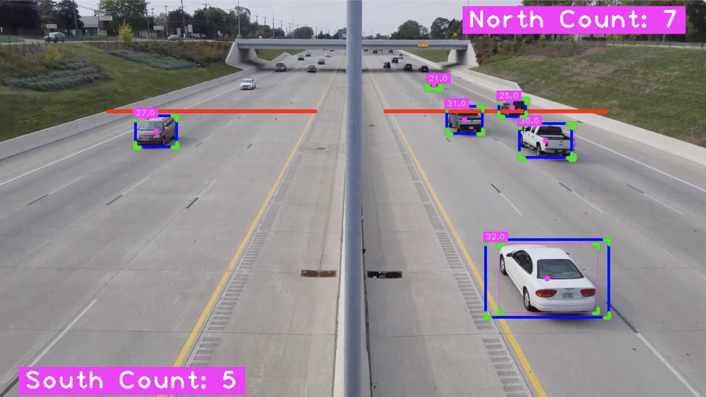

<!-- Improved compatibility of back to top link: See: https://github.com/othneildrew/Best-README-Template/pull/73 -->
<a name="readme-top"></a>


<!-- PROJECT LOGO -->
<br />
<div align="center">
  <p align="center">
    A set of projects to learn about Computer Vision
    <br />
  </p>
</div>

<!-- TABLE OF CONTENTS -->
<details>
  <summary>Table of Contents</summary>
  <ol>
    <li>
      <a href="#getting-started">Getting Started</a>
      <ul>
        <li><a href="#prerequisites">Prerequisites</a></li>
        <li><a href="#installation">Installation</a></li>
      </ul>
    </li>
    <li>
      <a href="#car-counter">Car Counter</a>
      <ul>
        
      </ul>
    </li>
  </ol>
</details>


<!-- GETTING STARTED -->
## Getting Started

This is a python project

### Prerequisites

1. Install all the requirements

```
pip install -r requirements.txt
```

### Installation

 step by step series of examples that tell you how to get a development env running

1. Install all the requirements

```
git clone https://github.com/LukaFlores/object-tracking-opencv.git
```

2. Change into specific Project Directory (e.g /Car-Counter)
```
cd Car-Counter
```

3. Run the Program
```
./build.sh
```
<p align="right">(<a href="#readme-top">back to top</a>)</p>


<!-- Car Counter -->
## Car Counter

The goal of the car counter is to track the number of cars that pass north and south on the freeway

#### How it was done

1. A mask was overlaid on the video to the area in which the vehicles could be identified. A bitwise * and * function was used to find the shared space of the mask and the video frame [Code](https://github.com/LukaFlores/object-tracking-opencv/blob/05fad2bb24db0296b3b97c996344c7752614ea34/Car-Counter/main.py#L52C1-L53)

<div align="center">
    
</div>

2. The current frame  


Use the `BLANK_README.md` to get started.

<p align="right">(<a href="#readme-top">back to top</a>)</p>


<p align="right">(<a href="#readme-top">back to top</a>)</p>
